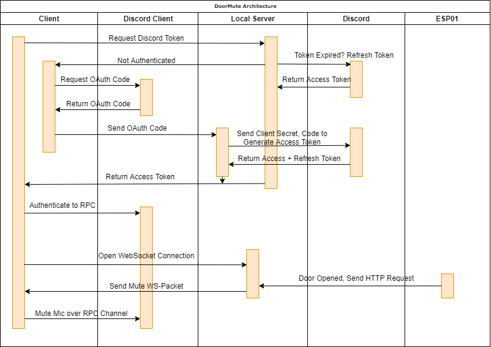
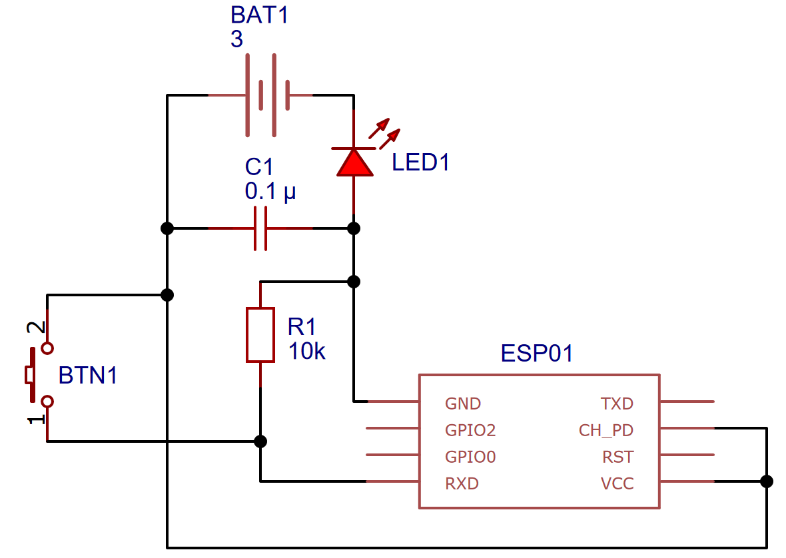

# DoorMute
Automatically mute your Discord Microphone when someone enters your room

## How it works
This project uses an ESP8266 module in combination with a button to detect
when your door opens. It then sends an HTTP request to a local server (for
example running on a Raspberry Pi) that notifies the DoorMute client running
on your device that in the end mutes your discord microphone.

I'm using the Discord RPC which requires an oauth access token for to be able to mute the
microphone. A local running server handles all the oauth stuff and sends
the access token in exchange for an auth token to the DoorMute client running
on your device. I decided to use a central server to be able to use
DoorMute on multiple devices. It is a (big) security risk, but it only
runs in my local network, so it is not a big deal. (I hope ._.)

Below you can see the authentication and app workflow:


## The ESP Device
For detecting when the door opens, I use an ESP01 module, because it 
has WLAN and little consumption. The circuit is very simple:

You can leave out the LED if you want.

For installing the button in your door, I just hot-glued it into the frame,
but you can get creative here.

This is the sketch for the ESP module: [esp.ino](esp.ino).

## Installation
First you need to configure the server using the `serverdata.json` file.
Create a new discord application and copy the client id and secret to the
`serverdata.json` file. Generate a random password for client auth and
store it in the `password`-json value.

Build the Docker image for the local server using `docker build` and deploy
it with `-p 3456:3465` and `-v serverdata.json:serverdata.json` on your local
server (pls not in the internet).

The client can be build using pyinstaller:
```shell
pyinstaller --noconfirm --onefile -w --paths "./venv/Lib/site-packages" --hidden-import "websockets.legacy" --hidden-import "websockets.legacy.client"  "./client.py"
```

After you built the client, you can build the installer using:
```shell
pyinstaller --noconfirm --onefile --console --add-data "./dist/client.exe;." --add-data "./resources;resources/" --paths "./venv/Lib/site-packages"  "./install.py"
```

Execute it to install the client.
When you are asked for a hostname, enter the hostname of your server + `:3465`.
The server password is the password you set in the `serverdata.json` file.

After that, the DoorMute client should be installed, running and added to start
menu and autostart. You can enable or disable it using the system tray icon.
